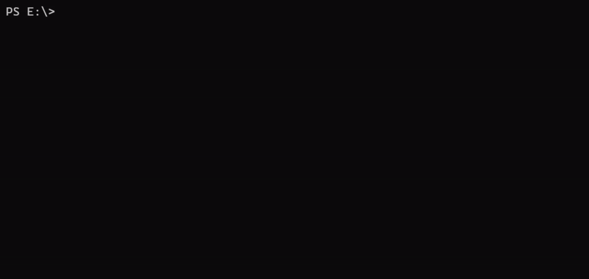

A [Vite](https://vitejs.dev) + [React](https://reactjs.org/) + [Redux Toolkit Query](https://redux-toolkit.js.org/tutorials/rtk-query) starter template with opt-in [TypeScript](https://www.typescriptlang.org/docs/handbook).

## Template Structure

This boilerplate template contains the files required to get started with the newly released RTK Query with React.

```
vite-react-rtkq
├── node_modules
├── src
│   ├── app
│   │   └── store.js
│   ├── features
│   │   ├── Pokemon.jsx
│   │   ├── Pokemons.jsx
│   │   └── pokemonSlice.js
│   ├── App.css
│   ├── App.jsx
│   ├── favicon.svg
│   ├── index.css
│   ├── logo.svg
│   └── main.jsx
├── .gitignore
├── index.html
├── package.json
└── vite.config.js
```

## Installation

```shell
# For JS Template
npx degit princerajroy/vite-react-rtkq/packages/template my-app
# For TS Template
npx degit princerajroy/vite-react-rtkq/packages/template-ts my-app

cd my-app
npm install
```

## Development

```shell
# Start the local vite dev server
npm run dev
```
Then open http://localhost:3000 to view it in the browser

## Production
```shell
# Generate a production build
npm run build
```

## Preview
```shell
# Run the production build locally
npm run serve
```

## Demo




## LICENSE

[MIT]("./../LICENSE")